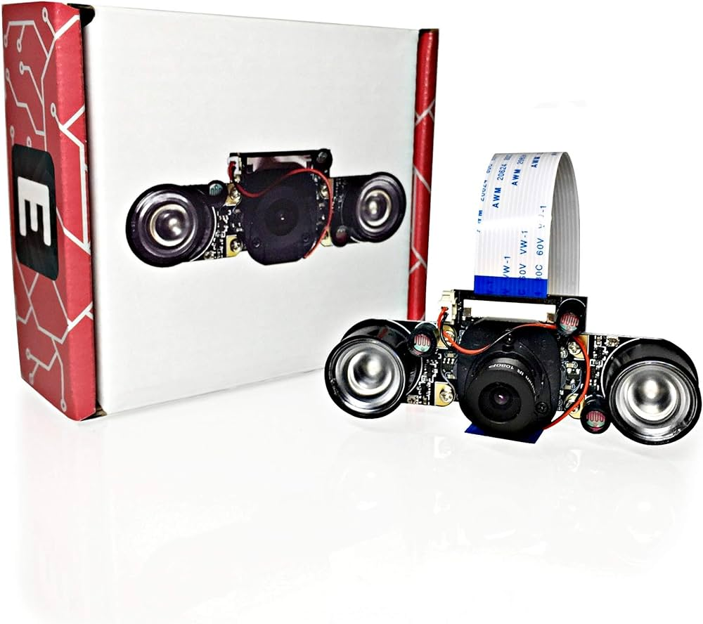

**Raspberry Pi - GSM/GPRS/GNSS/CCTV**

This project integrates **GSM** (Global System for Mobile Communications) for mobile communication, **GPRS** (General Packet Radio Service) for efficient data transmission, and **GNSS** (Global Navigation Satellite System) for precise positioning. Additionally, it incorporates a CCTV (Closed-Circuit Television) system using video cameras for surveillance. Together, these technologies enable a comprehensive solution with mobile communication, data connectivity, accurate navigation, and visual monitoring capabilities.<br>

- ## **Description**
Thanks to the GSM/GPRS/GNSS board for Raspberry Pi, we will be able to monitor the current position of our SBC using GPS coordinates and GSM text messages recording a video if a GPIO will get an impulse. <br>
In the context of this project, we use **GSM/GPRS/GNSS board** and **PiCamera for Raspberry Pi**. <br>

- ## Step By Step
1. [Prerequisites](#prerequisites)<br>
2. [Device Preparation](#preparazione)<br>
3. [How to use it](#howtouseit)<br>
4. [Pros & Cons](#pros-and-cons)<br>
5. [Curiosities](#curiosities)<br>
6. [Support](#support)<br>
   
# 1. Prerequisites <div id="prerequisites"></div>
- **Raspberry Pi**: It should work well with all Raspberry Pi models: (https://www.raspberrypi.com/)<br>
- **GSM/GPRS/GNSS board**: <br> (https://files.waveshare.com/upload/4/4a/GSM_GPRS_GNSS_HAT_User_Manual_EN.pdf), <br>
- **PiCamera for Raspberry Pi**: <br> ('[https://tlk.dedemapp.com/Machines/Details/203181](https://www.amazon.it/Electreeks%C2%AE-fotocamera-Raspberry-automatico-infrarossi/dp/B08C5GDG9Q?th=1)') <br>

## Where to buy GSM/GPRS/GNSS board for Raspberry Pi?
<br>
*GSM/GPRS/GSNN Board*<br>
[Amazon]()|[Aliexpress]()<br>

## Where to buy Raspberry Pi IR Camera?
<br>
*RaspiCamera IR*<br>
[Amazon](https://www.amazon.it/Electreeks%C2%AE-fotocamera-Raspberry-automatico-infrarossi/dp/B08C5GDG9Q?th=1)|[Aliexpress](https://www.aliexpress.us/item/2251832597184177.html?spm=a2g0o.productlist.main.1.2ef2365f0gDFCP&algo_pvid=89b3c4b3-a9dc-4238-84d1-948b387117d4&algo_exp_id=89b3c4b3-a9dc-4238-84d1-948b387117d4-0&pdp_npi=4%40dis%21EUR%2113.83%219.96%21%21%2114.71%2110.59%21%402103225217060051148274358e38cd%2112000037102820125%21sea%21US%214652921009%21&curPageLogUid=uDZvQ76DhRfl&utparam-url=scene%3Asearch%7Cquery_from%3A)<br>

## Compatible SBCs?
All Raspberry Pi series<br>

# 2. Device Preparation <div id="preparazione"></div>
**1 - Plug GPS/GSM/GNSS board on the array of GPIO in order to match all pins**<br>

**2 - Connect GPS antenna and the one for GSM**<br>

**3 - Plug the PiCamera's flat into the connector of Raspberry Pi**<br>

**4 - Turn on device, be sure to enable RX/TX Uart**<br>

**5 - Clone this repository and move in**<br>
  
**6 - System Configuration** <div id="configurazione"></div>
Open "configuration" file and fill the empty values with yours: 
```
{
    "receiverNumber": "", #<--Your number where to receive alerts--
    "localSMSC": "", #<--Smsc number--
    "apn": "", #<--SIM card's APN--
    ...
}
```

**6 - Run the bash in order to make a new daemon**<br>
- `sudo bash install.sh` <br>
- `sudo systemctl start gps` <br>

# 3. How to use it? <div id="howtouseit"></div>
Once the system is running he will start searching for its GPS coordinates and listening for incoming calls or messagges.
All the coordinates will be stored to ***generalDB.db*** every n minutes(depending on the configuration). As a result, the system will be able to retrieve the last record stored in the database.
If you were to call the sytem or send it a text message with ***007***, it will respond with the last coordinates received. Before doing so, ensure you have filled in the correct configuration with your telephone number to receive messages back.
Another interesting feature is the presence of a system that checks if GPS has been moved over various distances. Since the project is developed in Europe, the result of the distance is in **meters**, but we could add new units of measurement in the next revisions.
If you have enabled the RaspiCamera in the configurations, you will be able to record a video when an impulse is received on GPIO 17(or the one you choosen on configurations).

# **4. Pros & Cons** <div id="pros-and-cons"></div>
| **Pros**                                      | **Cons**                                                |
|-----------------------------------------------|----------------------------------------------------------|
| Global coverage                               | Limited Data Speeds                                      |
| Efficiency in Data Transmission               | Network Congestion                                       |
| Standardized Technology                       | Technology Aging                                         |
| Low Power Consumption                         | Security concerns                                        |
| Support for IoT Applications                  | Spectrum Allocation Challenges                           | 

# **5. Curiosities** <div id="curiosities"></div>
1. Triangulation Technique: GPS works based on a process called trilateration, not triangulation as commonly believed. Trilateration involves measuring distances from known points (satellites) to determine an unknown position (receiver). The more satellites involved, the more accurate the position fix.
2. Relativity Adjustment: Einstein's theory of general relativity plays a role in the accuracy of GPS. The satellites' atomic clocks, which are crucial for precise timing, experience time dilation due to their relative motion and the gravitational field. Without adjustments, GPS accuracy would suffer by several meters per day.
3. Selective Availability: The U.S. military used to intentionally degrade the accuracy of GPS signals for civilian users. This feature, known as Selective Availability, was turned off in 2000 by the U.S. government, significantly improving GPS accuracy for everyone.
4. Dual-frequency Receivers: Modern GPS receivers can receive signals on two frequencies (L1 and L5). This dual-frequency capability helps mitigate signal errors caused by the Earth's atmosphere, providing more accurate positioning, especially in challenging environments.
5. GPS Constellation: The GPS system comprises a constellation of at least 24 satellites orbiting the Earth. These satellites are strategically positioned to ensure that a GPS receiver on Earth can receive signals from at least four satellites at any given time, allowing for accurate positioning and navigation.

# **6. Support** <div id="support"></div>
For any questions, bug reports, or feature requests, please open a new issue in our GitHub repository. We will strive to respond as quickly as possible.
For more urgent inquiries or other issues, you can contact us via email at davide.polli@dedem.it. Please include complete details about the encountered problem for a faster resolution.
We are committed to continually improving the application and value every contribution and feedback from our community.

