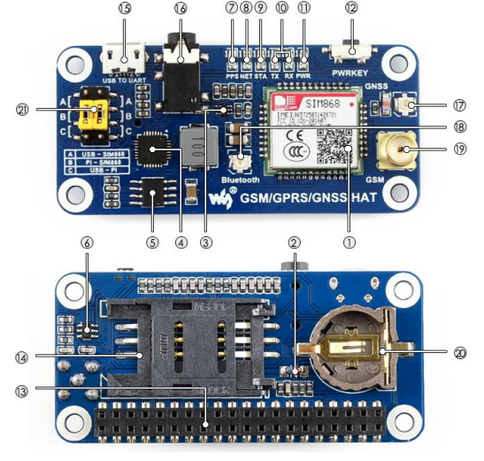

# Raspberry Pi GPS-GSM-GNSS-CCTV System

## Overview

This project transforms your Raspberry Pi into a versatile GPS-GSM-GNSS (Global Positioning System - Global System for Mobile Communications - Global Navigation Satellite System) system. With this system, you can track the location of your Raspberry Pi in real-time and communicate with it remotely using GSM capabilities.

## Features

- Real-time GPS tracking
- GSM communication for remote interaction
- GNSS for precise positioning
- Videocamera recording
- Modular design for easy customization
- Support for external antennas

## Prerequisites

Before getting started, ensure you have the following hardware and software:

- Raspberry Pi (compatible models: [list compatible models])
- GPRS,GSM,GNSS module (https://files.waveshare.com/upload/4/4a/GSM_GPRS_GNSS_HAT_User_Manual_EN.pdf)
- 
- [Any other specific hardware requirements]

## Installation

1. [Installation step 1]
2. [Installation step 2]
3. [Installation step 3]
   ```bash
   [code snippet if applicable]
