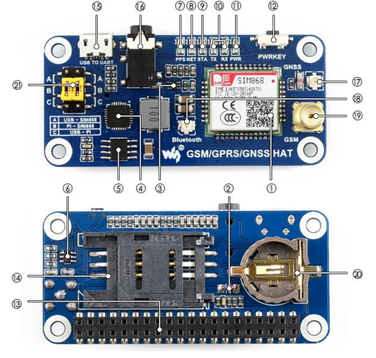

**Raspberry Pi - GSM/GPRS/GNSS/CCTV**

This project integrates GSM (Global System for Mobile Communications) for mobile communication, GPRS (General Packet Radio Service) for efficient data transmission, and GNSS (Global Navigation Satellite System) for precise positioning. Additionally, it incorporates a CCTV (Closed-Circuit Television) system using video cameras for surveillance. Together, these technologies enable a comprehensive solution with mobile communication, data connectivity, accurate navigation, and visual monitoring capabilities.<br>

- ## **Description**
Thanks to the GSM/GPRS/GNSS board for Raspberry Pi, we will be able to monitor the current position of our SBC using GPS coordinates and GSM text messages recording a video if a GPIO will get an impulse. <br>
In the context of this project, we use the followings:<br>

**GSM/GPRS/GNSS board**: <br> (https://files.waveshare.com/upload/4/4a/GSM_GPRS_GNSS_HAT_User_Manual_EN.pdf), <br>

**PiCamera for Raspberry Pi**: <br> ('[https://tlk.dedemapp.com/Machines/Details/203181](https://www.amazon.it/Electreeks%C2%AE-fotocamera-Raspberry-automatico-infrarossi/dp/B08C5GDG9Q?th=1)') <br>

- ## Step By Step
1. [Prerequisites](#prerequisites)<br>
2. [Device Preparation](#preparazione)<br>
3. [Setup](#configurazione)<br>
4. [How to use it](#howtouseit)<br>
5. [Pros & Cons](#pros-and-cons)<br>
6. [Curiosities](#curiosities)<br>
7. [Support](#support)<br>
   
- # 1. Prerequisites <div id="prerequisites"></div>
**CubeCell – AB01 Dev-Board**: Heltec development board.<br>
**USB Cable**: USB cable to connect the board to the Smartphone.

## Where to buy GSM/GPRS/GNSS board for Raspberry Pi?
<br>
*GSM/GPRS/GSNN Board*<br>
[Amazon](https://www.amazon.it/Electreeks%C2%AE-fotocamera-Raspberry-automatico-infrarossi/dp/B08C5GDG9Q?th=1)|[Aliexpress](https://www.aliexpress.us/item/2251832597184177.html?spm=a2g0o.productlist.main.1.2ef2365f0gDFCP&algo_pvid=89b3c4b3-a9dc-4238-84d1-948b387117d4&algo_exp_id=89b3c4b3-a9dc-4238-84d1-948b387117d4-0&pdp_npi=4%40dis%21EUR%2113.83%219.96%21%21%2114.71%2110.59%21%402103225217060051148274358e38cd%2112000037102820125%21sea%21US%214652921009%21&curPageLogUid=uDZvQ76DhRfl&utparam-url=scene%3Asearch%7Cquery_from%3A)<br>

## Where to buy Raspberry Pi Camera IR?
<br>
*GSM/GPRS/GSNN Board*<br>
[Amazon](https://www.amazon.it/Electreeks%C2%AE-fotocamera-Raspberry-automatico-infrarossi/dp/B08C5GDG9Q?th=1)|[Aliexpress](https://www.aliexpress.us/item/2251832597184177.html?spm=a2g0o.productlist.main.1.2ef2365f0gDFCP&algo_pvid=89b3c4b3-a9dc-4238-84d1-948b387117d4&algo_exp_id=89b3c4b3-a9dc-4238-84d1-948b387117d4-0&pdp_npi=4%40dis%21EUR%2113.83%219.96%21%21%2114.71%2110.59%21%402103225217060051148274358e38cd%2112000037102820125%21sea%21US%214652921009%21&curPageLogUid=uDZvQ76DhRfl&utparam-url=scene%3Asearch%7Cquery_from%3A)<br>


## Compatible SBCs?
All Raspberry Pi series<br>

- # 2. Device Preparation <div id="preparazione"></div>
**1 - Plug the board on the array of GPIO**<br>

**2 - Plug the PiCamera's flat into the connector of Raspberry Pi**<br>

**3 - Turn on device, be sure to enable RX/TX Uart**<br>

**4 - Clone this repository and move in**<br>

**3 - Run the bash in order to make a new daemon**<br>
- `sudo bash install.sh`

- # 3. System Configuration <div id="configurazione"></div>
**1 - Open "configuration" file and fill the empty values with yours:** <br>
```
{
    "receiverNumber": "",
    "localSMSC": "",
    "apn": "",
    "dbPath": "/home/pi/data/generalDB.db",
    "minDistance": 50,
    "keyTextMessage": "007",  
    "logPath": "/home/pi/piHat/logs/gps.log",
    "powerPin": 4,
    "timer_keep_send_message": 600,
    "timer": 60,
    "timer_sync_ntp": 150,
    "videoPath": "/home/pi/Videos/",
    "minRunDistance": 100,
    "pinNumber": 17
}
```

- # 4. How to use it <div id="howtouseit"></div>

- # **4. Pros & Cons** <div id="pros-and-cons"></div>
| **Pros**                                      | **Cons**                                                |
|-----------------------------------------------|----------------------------------------------------------|
| Wide coverage                                 | Limited bandwidth                                        |
| Low power consumption                         | Limited transmission speed                               |
| Obstacle penetration                          | Interference                                             |
| Reduced costs                                 | Security concerns                                        |
| Application versatility                       | Data packet limitations                                  | 

- # **5. Curiosities** <div id="curiosities"></div>
1. LoRa utilizes sub-gigahertz radio frequency bands such as 433 MHz, 868 MHz (Europe), and 915 MHz (North America).
2. It ensures long-range transmissions (over 10 km in rural areas, 3–5 km in highly urbanized zones) with low power consumption.
3. It consists of two parts: LoRa, the physical layer, and LoRaWAN (Long Range Wide Area Network), the upper layers.
4. New LoRa chipsets feature reduced power consumption, increased transmission power, and smaller sizes compared to previous generations.
5. It offers geolocation capabilities to triangulate device positions using timestamps from gateways.
6. Provides long-range connectivity for Internet of Things (IoT) devices across various sectors.
7. Reference to [AT Command User Manual](https://resource.heltec.cn/download/CubeCell/AT_Command_list/CubeCell_Series_AT_Command_User_Manual_V0.4.pdf)
8. Reference to [Understanding LoRa](https://development.libelium.com/lora_networking_guide/understanding-lora)

- # **6. Support** <div id="support"></div>
For any questions, bug reports, or feature requests, please open a new issue in our GitHub repository. We will strive to respond as quickly as possible.
For more urgent inquiries or other issues, you can contact us via email at davide.polli@dedem.it. Please include complete details about the encountered problem for a faster resolution.
We are committed to continually improving the application and value every contribution and feedback from our community.

